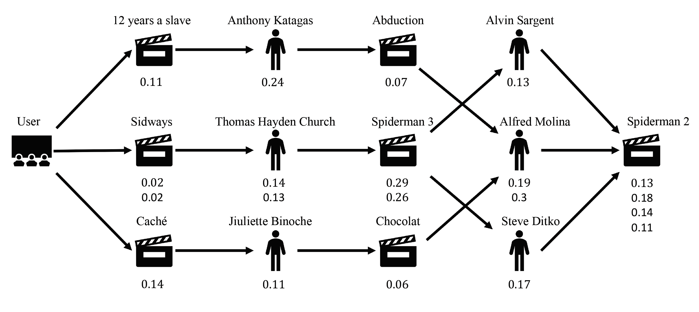

Prerequisites
-------------

1. Run `pip install -r requirements.txt`
2. Run `git clone` hier imdb_ml cloning
3. Install imdb_ml locally via `pip install -e imdb_ml`

PHATN
-----------

The model I created myself is called PHATN (Path Hierarchical Attention Network).
The basic idea is to ask whether an external entity should be aligned with a graph.
The following application asks whether a user likes a movie.
The two data sources IMDb and MovieLens are merged in order to form an
entity alignment problem. Here, the user is the external entity.

The high level model architecture looks as follows:

Overview over the model architecture of PHATN. By X_G we denote graph node embeddings and
by X_T embeddings of external entities.
In the first attention layer, the external element t attends to each node in a Path
and in the second attention layer, the external element t attends to each
path embedding.
